# 2024_paris3

<html lang="ja">
 <head>
  <meta charset="utf-8" />
 

<link href="https://cdnjs.cloudflare.com/ajax/libs/lightbox2/2.7.1/css/lightbox.css" rel="stylesheet">
   
</head>
<!--
<body onload="alert('65歳まで、よく頑張りました！　まだまだ元気に〜〜(^o^)/')" onunload="alert('再会の時まで、元気でお過ごしくださいませ〜(^o^)/')">
-->

  モバイル端末をお使いの場合は、画面を横向きにするとより見やすくご覧頂けます。

<!--
-->

<a href="https://torokoid.github.io/2024_paris/">2024年7月19日〜21日</a>><a href="https://torokoid.github.io/2024_paris/">22日〜23日</a>>24日〜
<!--
-->

 &nbsp;Bruce 23日〜

<!--
<h2><a href="https://torokoid.github.io/list">クラス会名簿リンク</a></h2>
-->
  

 アクセス用QRコード

<marquee direction="right" scrollamount="20" width="30%">(^_^)/~hada</marquee>

<h2><marquee behavior="left">!!! 2024年7月23日の昼間、ボルドーに移動しました。パリのモンパルナス駅の自動改札がトラブルを起こし、駅員がワイヤレスバーコードリーダでQRコードを確認 !!!</marquee></h2>
<!--

-->

<h3> ～～～2024年7月24日着の画像です！～～～  </h3>

<a href="20240724_002.JPG" data-lightbox="abc">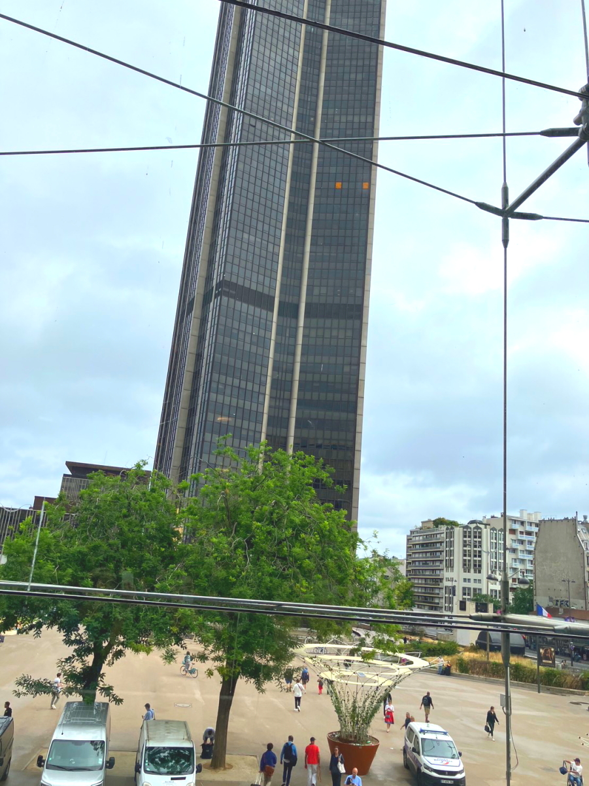</a>

<a href="20240724_004.JPG" data-lightbox="abc">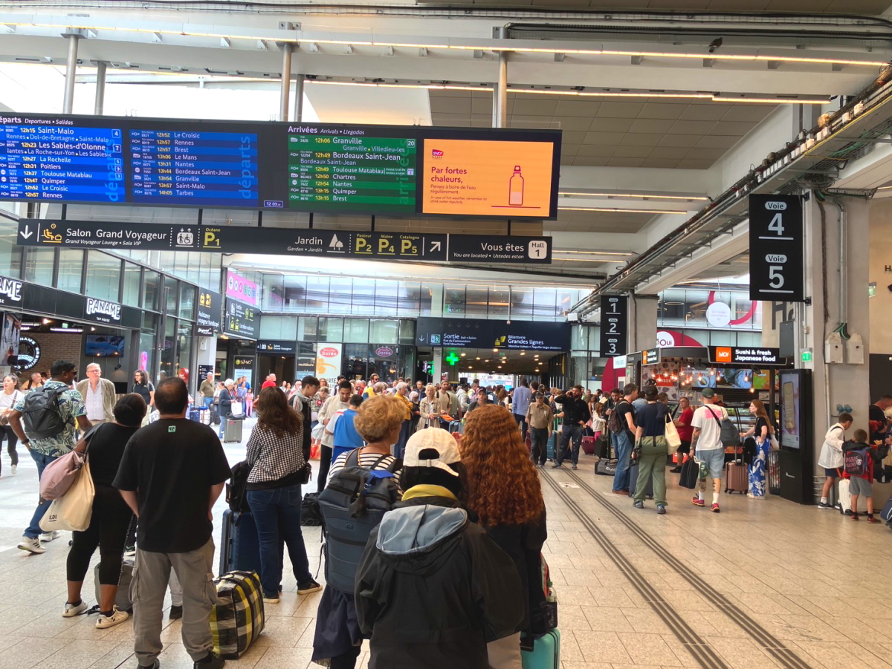</a>

<iframe width="560" height="315" src="https://www.youtube.com/embed/yzAizdxZNKs?si=5t3_E0mb4F7eewQj" title="YouTube video player" frameborder="0" allow="accelerometer; autoplay; clipboard-write; encrypted-media; gyroscope; picture-in-picture; web-share" referrerpolicy="strict-origin-when-cross-origin" allowfullscreen></iframe>

<iframe width="560" height="315" src="https://www.youtube.com/embed/UbyYCf7mihU?si=cPo3nMTIWvjpTgE5" title="YouTube video player" frameborder="0" allow="accelerometer; autoplay; clipboard-write; encrypted-media; gyroscope; picture-in-picture; web-share" referrerpolicy="strict-origin-when-cross-origin" allowfullscreen></iframe>

<iframe width="560" height="315" src="https://www.youtube.com/embed/-j3PsrcaZ-s?si=oSGsLxo_GheMbxNO" title="YouTube video player" frameborder="0" allow="accelerometer; autoplay; clipboard-write; encrypted-media; gyroscope; picture-in-picture; web-share" referrerpolicy="strict-origin-when-cross-origin" allowfullscreen></iframe>

<a href="20240724_006.JPG" data-lightbox="abc">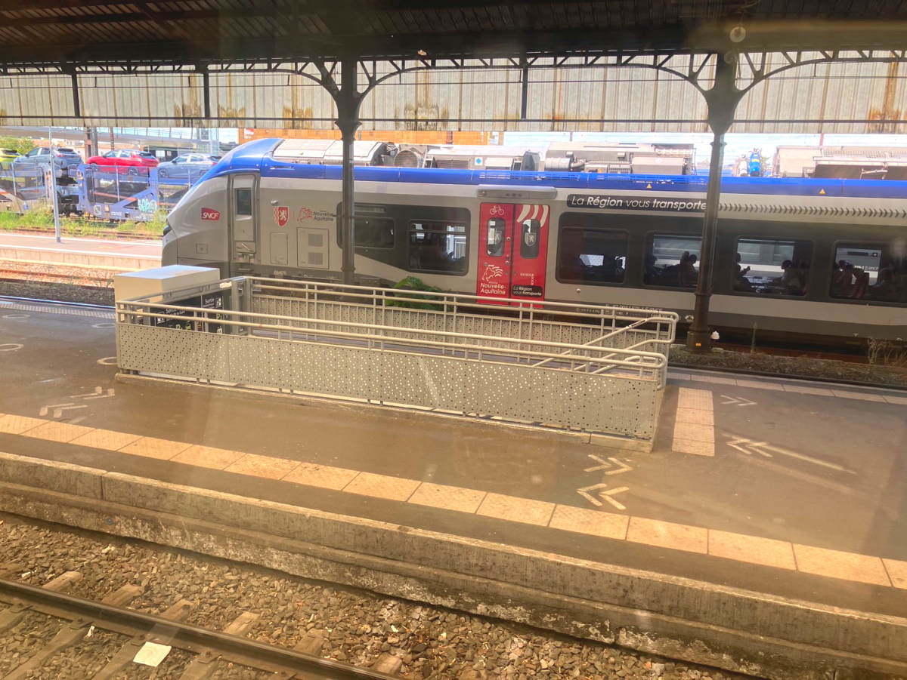</a>

<iframe width="560" height="315" src="https://www.youtube.com/embed/n28b_iJEzAQ?si=hyuibYCLnwRB3jvL" title="YouTube video player" frameborder="0" allow="accelerometer; autoplay; clipboard-write; encrypted-media; gyroscope; picture-in-picture; web-share" referrerpolicy="strict-origin-when-cross-origin" allowfullscreen></iframe>

<iframe width="560" height="315" src="https://www.youtube.com/embed/ep1CMOwV2Mw?si=awbzwmtzeR8RWSl8" title="YouTube video player" frameborder="0" allow="accelerometer; autoplay; clipboard-write; encrypted-media; gyroscope; picture-in-picture; web-share" referrerpolicy="strict-origin-when-cross-origin" allowfullscreen></iframe>

<a href="20240724_007.JPG" data-lightbox="abc">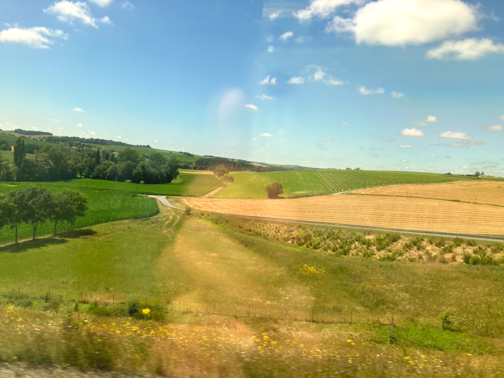</a>

<a href="20240724_009.JPG" data-lightbox="abc">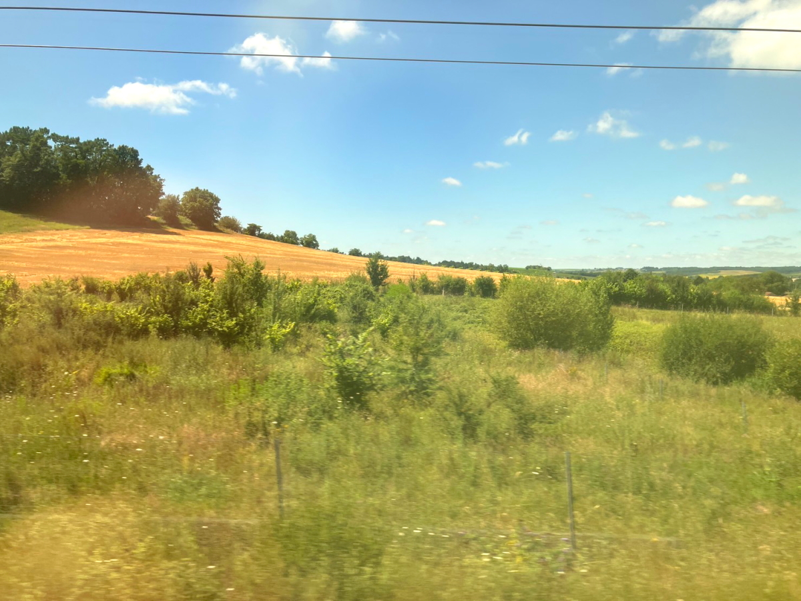</a>

<h3> ～～～最初の停車駅の後、警察官が見回り開始。その後、車掌がQRコード確認、日本では、もうやってない～～～  </h3>

<iframe width="560" height="315" src="https://www.youtube.com/embed/PWjZK5m5YN0?si=V02z1jQjdZ8O7xyC" title="YouTube video player" frameborder="0" allow="accelerometer; autoplay; clipboard-write; encrypted-media; gyroscope; picture-in-picture; web-share" referrerpolicy="strict-origin-when-cross-origin" allowfullscreen></iframe>

<iframe width="560" height="315" src="https://www.youtube.com/embed/boVj4_gqc5I?si=HOInEc9EpJnbDfti" title="YouTube video player" frameborder="0" allow="accelerometer; autoplay; clipboard-write; encrypted-media; gyroscope; picture-in-picture; web-share" referrerpolicy="strict-origin-when-cross-origin" allowfullscreen></iframe>

<iframe width="560" height="315" src="https://www.youtube.com/embed/X4kF-mVKo-s?si=YfJqqhH2KHBkYsV0" title="YouTube video player" frameborder="0" allow="accelerometer; autoplay; clipboard-write; encrypted-media; gyroscope; picture-in-picture; web-share" referrerpolicy="strict-origin-when-cross-origin" allowfullscreen></iframe>

<iframe width="560" height="315" src="https://www.youtube.com/embed/HlUgoKsElIQ?si=_RVbyILe1WO1ip4m" title="YouTube video player" frameborder="0" allow="accelerometer; autoplay; clipboard-write; encrypted-media; gyroscope; picture-in-picture; web-share" referrerpolicy="strict-origin-when-cross-origin" allowfullscreen></iframe>

<h2><marquee behavior="left">!!! 定刻15:08ボルドー到着！ヨーロッパで電車が時間通りに運行されたのは驚いた !!!</marquee></h2>

<iframe width="560" height="315" src="https://www.youtube.com/embed/AqRsF32JXcM?si=P4RVHesrNa4fIGYY" title="YouTube video player" frameborder="0" allow="accelerometer; autoplay; clipboard-write; encrypted-media; gyroscope; picture-in-picture; web-share" referrerpolicy="strict-origin-when-cross-origin" allowfullscreen></iframe>

<a href="20240724_012.JPG" data-lightbox="abc">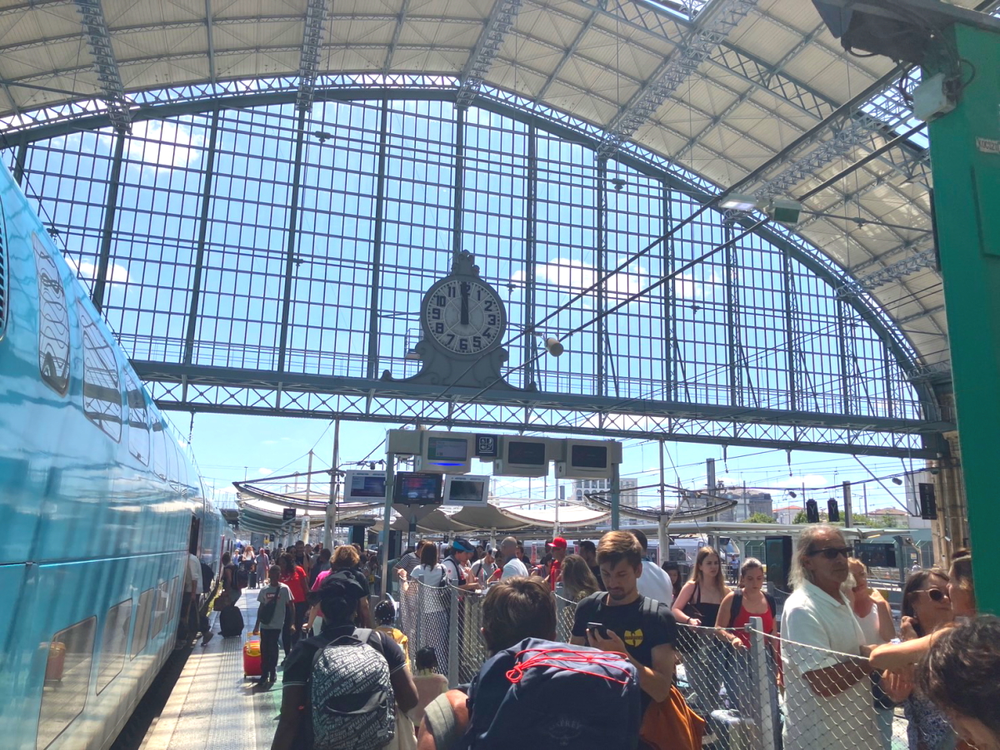</a>

<h2><marquee behavior="left">!!! バスで市内へ。Booking.comで予約したアパートに到着 !!!</marquee></h2>

<a href="20240724_016.JPG" data-lightbox="abc">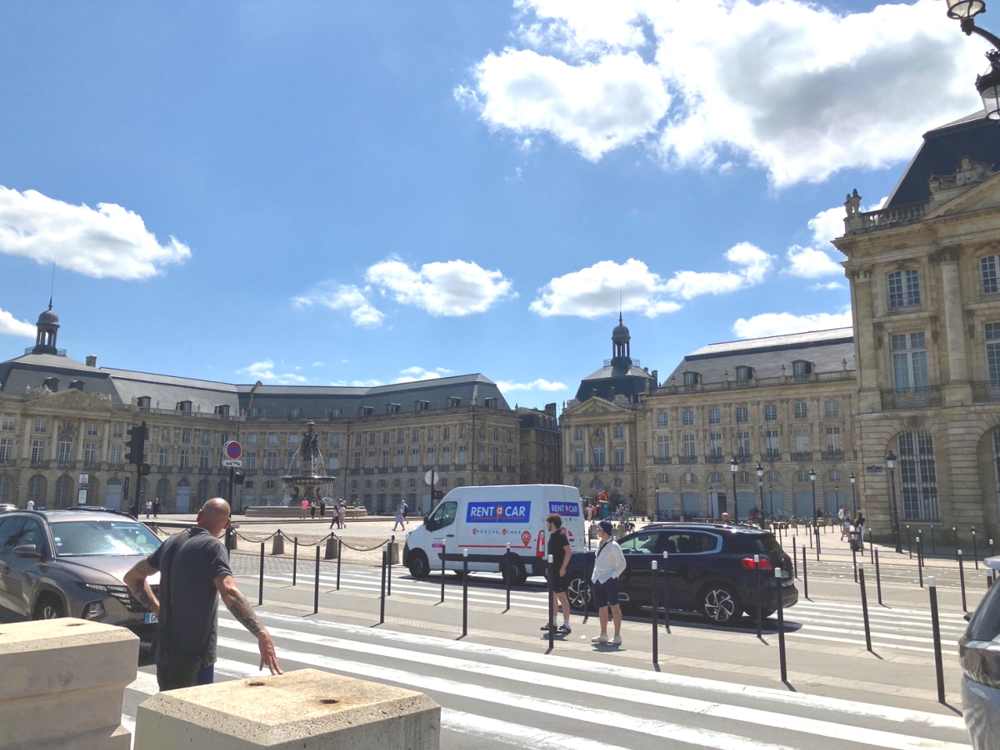</a>
<a href="20240724_017.JPG" data-lightbox="abc">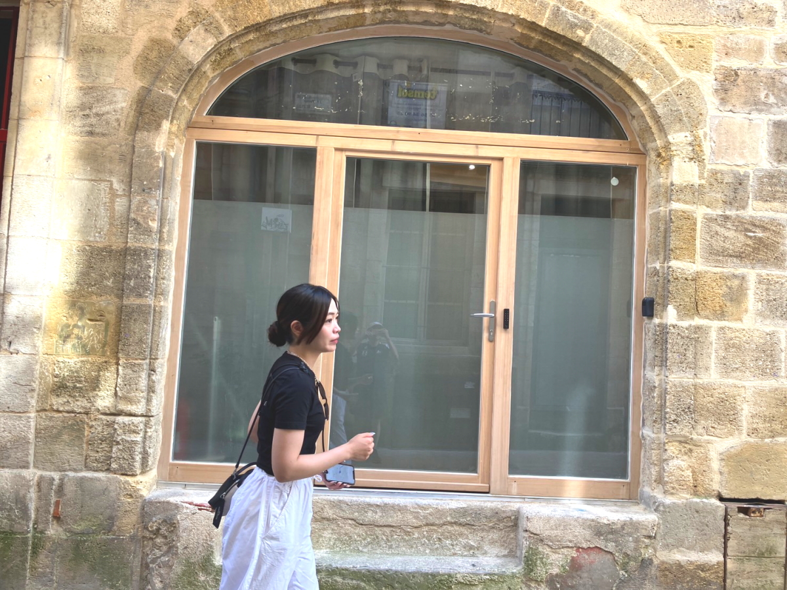</a>
<a href="20240724_018.JPG" data-lightbox="abc">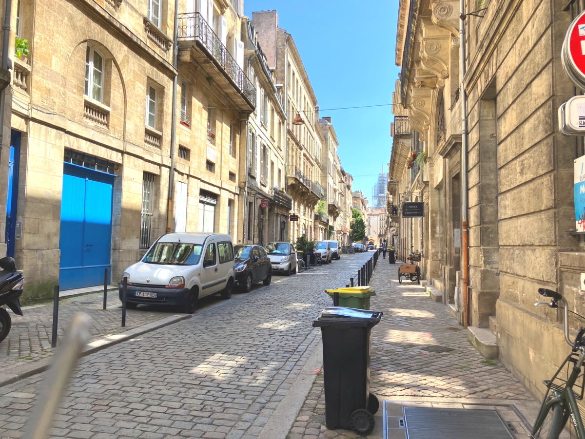</a>

<h3> ～～～予め連絡された暗証番号でドアを開けるだけです。市内観光へ。～～～  </h3>

<a href="20240724_019.JPG" data-lightbox="abc">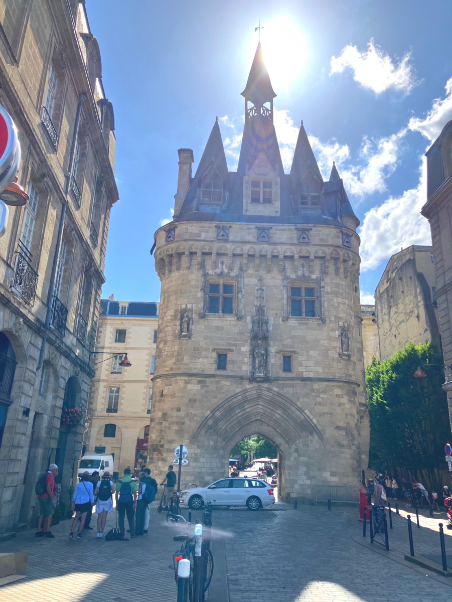</a>

<a href="20240724_021.JPG" data-lightbox="abc">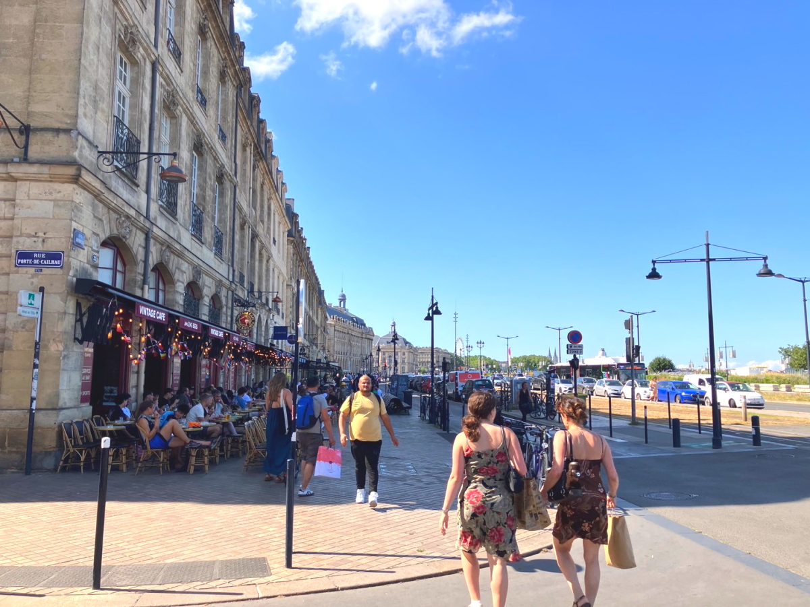</a>

<a href="20240724_024.JPG" data-lightbox="abc">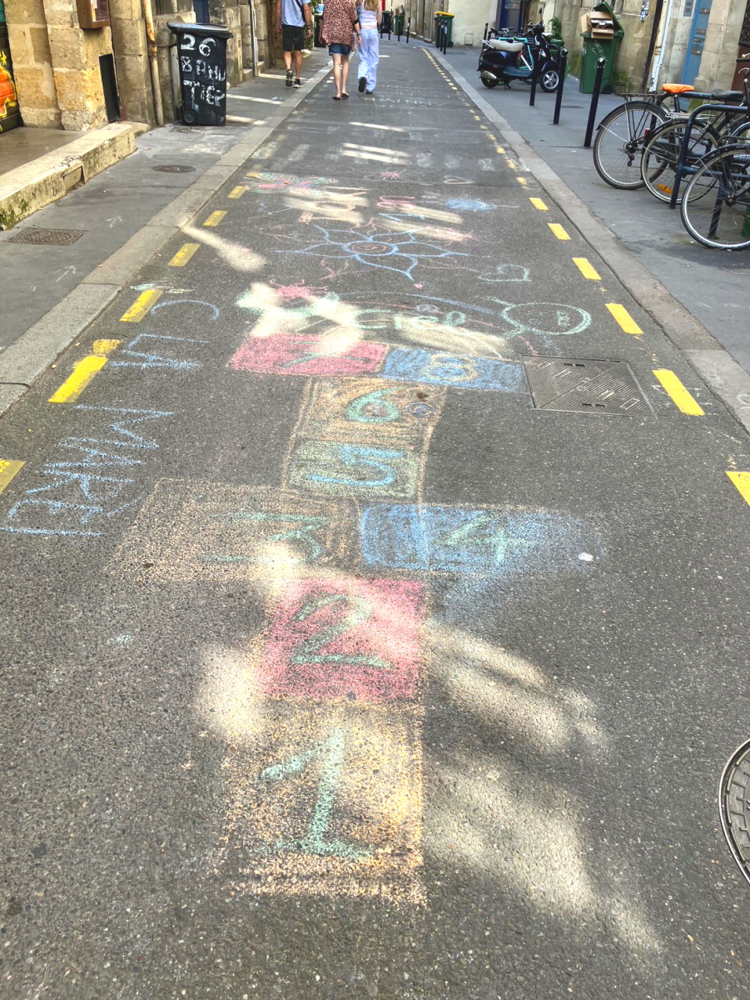</a>

<a href="20240724_030.JPG" data-lightbox="abc">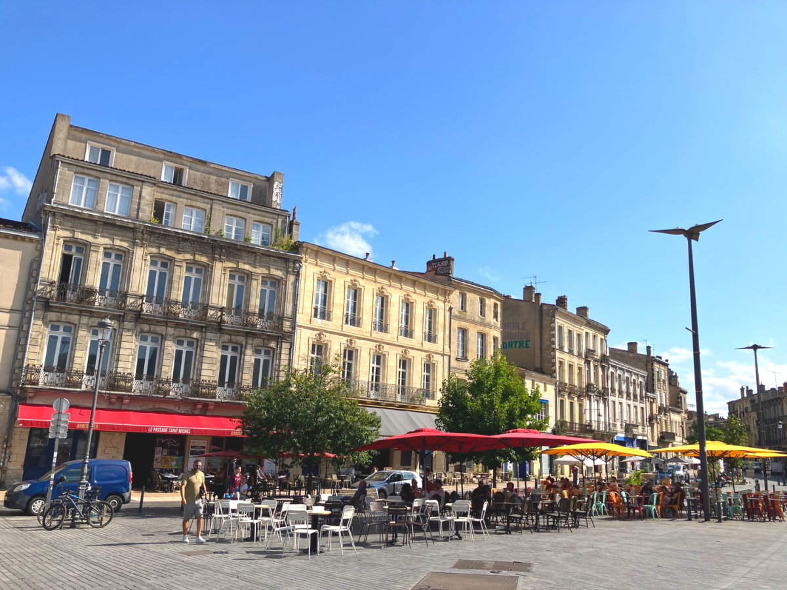</a>

<h2><marquee behavior="left">!!!サンミッシェル大聖堂の中に入った!!!</marquee></h2>

<h3> ～～～お向かいのユニクロ～～～  </h3>

<h2><marquee behavior="left">!!!21日の夜、次女がパリに到着,家族全員揃った,どこに行きたい？凱旋門とエッフェル塔,我々は2回目,その後、シテ島まわりを夜散歩!!!</marquee></h2>

<h3> ～～～ホテルはセーヌ川の近く～～～  </h3>

<h3> ～～～前の日にはなかったフランス国旗が凱旋門につるされてました～～～  </h3>

<h3> ～～～家族全員で夕食～～～  </h3>

<h3> ～～～22日美術館に行く途中、ポンピードセンターの前を通った,セーヌ川でオープニングセレモニーの練習？～～～  </h3>

<h2><marquee behavior="left">!!!23日,パリに家族全員集合です!!!</marquee></h2>

<h3> ～～～次女と２ショット！～～～  </h3>

<h3> ～～～長女、次女、私、カミさん～～～  </h3>

  

<h3> 長女とカミさんは7/18到着、7/22帰国 
次女は7/21到着 
サッカーを二試合スタジアム観戦、 
7/26オープニングセレモニー 
7/27帰国 
私は日本サッカーが決勝進出したら、8/13帰国です  </h3>

      

                             

                             
        

  

 

<!-- フッタ -->
 <footer>
 <h3>Copyright 2024/Jul/24 S.Hada</h3>
 </footer>
